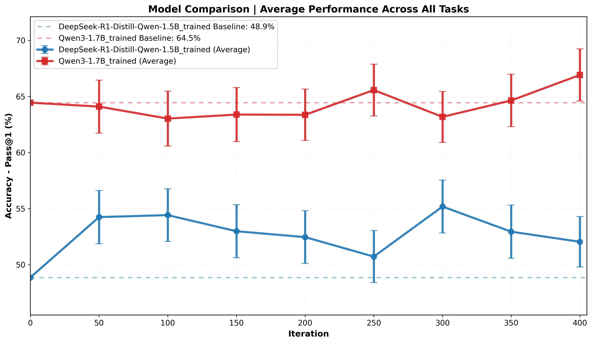
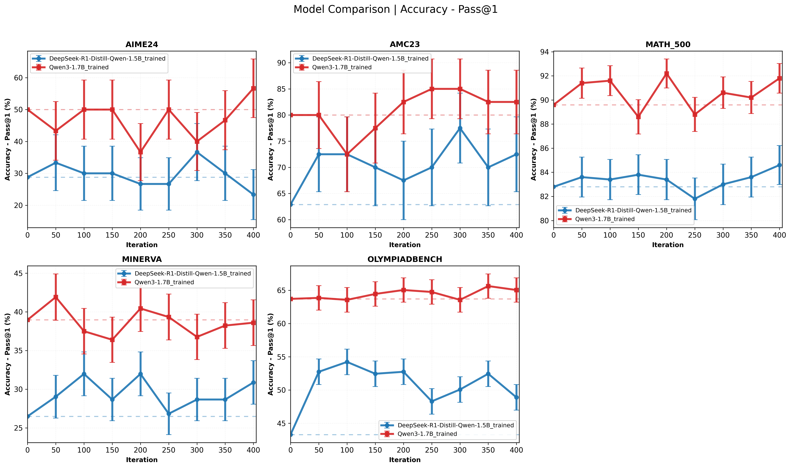
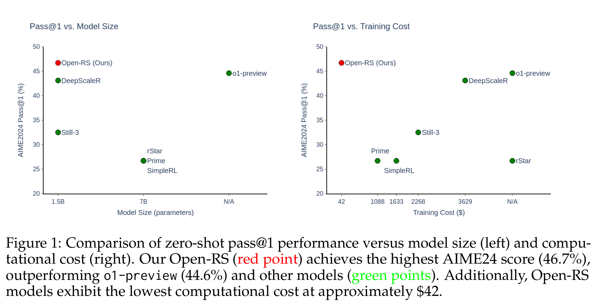
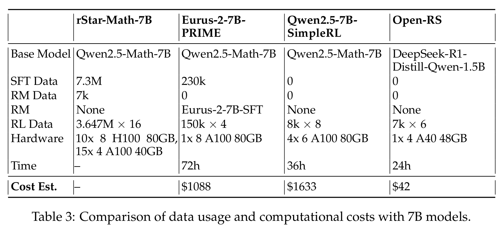
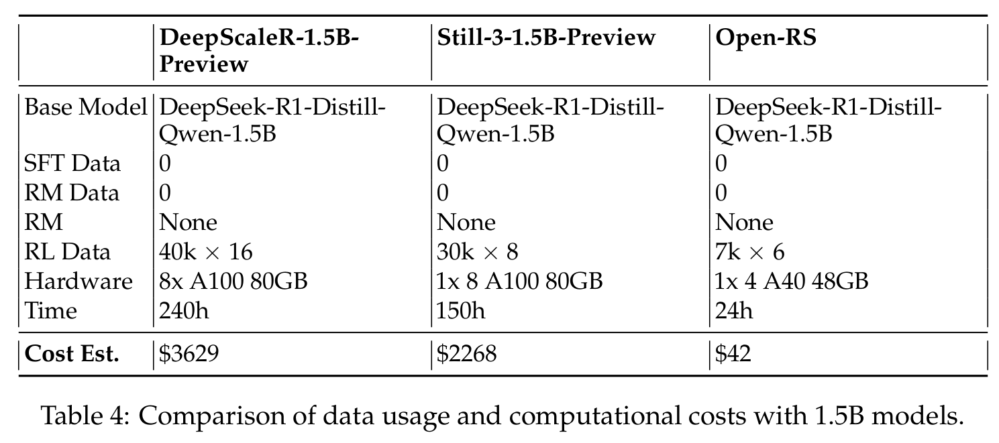

# Open-RS Paper Reproduction and Extension

> **Credit:** This README is based on the original work by Quy-Anh Dang and Chris Ngo from [https://github.com/knoveleng/open-rs](https://github.com/knoveleng/open-rs). All credit for the original project, code, and documentation goes to the authors. This fork reproduces the paper's results for experiment 3 and extends the work by adding a usage example for fine-tuning Qwen3-1.7B.

> Please press ⭐ button if you feel helpful!


This is my take on the code, based on the original **Open RS** project, accompanying the paper [*Reinforcement Learning for Reasoning in Small LLMs: What Works and What Doesn't*](https://arxiv.org/abs/2503.16219). The project explores enhancing reasoning capabilities in small large language models (LLMs) using reinforcement learning (RL) under resource-constrained conditions.

## Reproduction and Extension

I have reproduced the results from the original paper and further extended the project by demonstrating how to fine-tune Qwen3-1.7B using the provided codebase. The summary table below compares the reproduced results and new experiments with those reported in the paper and other models.

## Summary Table

| Model | AIME24 | MATH-500 | AMC23 | Minerva | OlympiadBench | Avg. |
|---|---|---|---|---|---|---|
| **General Models** |||||||
| Llama-3.1-70B-Instruct | 16.7 | 64.6 | 30.1 | 35.3 | 31.9 | 35.7 |
| o1-preview | 44.6 | 85.5 | – | – | – | – |
| **7B Models** |||||||
| Qwen-2.5-Math-7B-Instruct | 13.3 | 79.8 | 50.6 | 34.6 | 40.7 | 43.8 |
| rStar-Math-7B | 26.7 | 78.4 | 47.5 | – | 47.1 | – |
| Eurus-2-7B-PRIME | 26.7 | 79.2 | 57.8 | 38.6 | 42.1 | 48.9 |
| Qwen2.5-7B-SimpleRL | 26.7 | 82.4 | 62.5 | 39.7 | 43.3 | 50.9 |
| **1.5-1.7B Models** |||||||
| DeepSeek-R1-Distill-Qwen-1.5B | 28.8 | 82.8 | 62.9 | 26.5 | 43.3 | 48.9 |
| Still-3-1.5B-Preview | 32.5 | 84.4 | 66.7 | 29.0 | 45.4 | 51.6 |
| DeepScaleR-1.5B-Preview | 43.1 | 87.8 | 73.6 | 30.2 | 50.0 | 57.0 |
| Qwen3-1.7B | 50.0 | 89.6 | 80.0 | 38.9 | 63.7 | 64.4 |
| **Author's Models** |||||||
| Open-RS1 (100 steps) | 30.0 | 83.8 | 70.0 | 29.0 | 52.4 | 53.0 |
| Open-RS2 (50 steps) | 30.0 | 85.4 | 80.0 | 30.5 | 52.4 | 55.7 |
| Open-RS3 (50 steps) | 46.7 | 84.4 | 72.5 | 26.8 | 51.3 | 56.3 |
| **Ben Lustig's Models** |||||||
| Reproduction (300 steps) | 36.6 | 83.0 | 77.5 | 28.6 | 50.0 | 55.1 |
| Qwen3-1.7B trained (400 steps) | 56.6 | 91.8 | 82.5 | 38.6 | 65.0 | 66.9 |





#### Ben Lustig's Models
- [OpenRS-GRPO_Qwen3](https://huggingface.co/Ben-Lustig/OpenRS-GRPO_Qwen3) - Qwen3-1.7B trained (400 steps)
- [OpenRS-GRPO_Exp3](https://huggingface.co/Ben-Lustig/OpenRS-GRPO_Exp3) - Reproduction (300 steps)

## Quy-Anh Dang and Chris Ngo's README Summary Below
We focus on a 1.5-billion-parameter model, `DeepSeek-R1-Distill-Qwen-1.5B`, trained on 4 NVIDIA A40 GPUs (48 GB VRAM each) within 24 hours. By adapting the Group Relative Policy Optimization (GRPO) algorithm and leveraging a curated, compact mathematical reasoning dataset, we conducted three experiments to assess performance and behavior. Key findings include:

- Significant reasoning improvements, e.g., AMC23 accuracy rising from 63% to 80% and AIME24 reaching 46.7%, outperforming `o1-preview`.
- Efficient training with just 7,000 samples at a cost of $42, compared to thousands of dollars for baseline models.
- Challenges like optimization instability and length constraints with extended training.

These results showcase RL-based fine-tuning as a cost-effective approach for small LLMs, making reasoning capabilities accessible in resource-limited settings. We open-source our code, models, and datasets to support further research.


## Resources

### Models
- [Open-RS1](https://huggingface.co/knoveleng/Open-RS1)
- [Open-RS2](https://huggingface.co/knoveleng/Open-RS2)
- [Open-RS3](https://huggingface.co/knoveleng/Open-RS3)
- Additional models in training: [knoveleng/OpenRS-GRPO](https://huggingface.co/knoveleng/OpenRS-GRPO/commits/main), [quyanh/OpenRS-GRPO](https://huggingface.co/quyanh/OpenRS-GRPO/commits/main)

### Datasets
- [open-s1](https://huggingface.co/datasets/knoveleng/open-s1)
- [open-deepscaler](https://huggingface.co/datasets/knoveleng/open-deepscaler)
- [open-rs](https://huggingface.co/datasets/knoveleng/open-rs) (used in Experiments 2 and 3)

### Collection
- [Open-RS Collection](https://huggingface.co/collections/knoveleng/open-rs-67d940abc201a7e7f252ca4e)

## Installation

### Prerequisites
Install `uv` for managing virtual environments:
```bash
curl -LsSf https://astral.sh/uv/install.sh | sh
export PATH="$HOME/.local/bin:$PATH"
```

Set up a virtual environment with Python 3.11:
```bash
uv venv openr1 --python 3.11
source openr1/bin/activate
uv pip install --upgrade pip
export UV_LINK_MODE=copy
```

### Dependencies
Install `vLLM` and `FlashAttention`:
```bash
uv pip install vllm==0.7.2
uv pip install setuptools
uv pip install flash-attn --no-build-isolation
```

> **Note**: This installs PyTorch `v2.5.1`, which is required for `vLLM` compatibility. Using a different version may cause issues.

Install additional dependencies based on your use case:
```bash
GIT_LFS_SKIP_SMUDGE=1 uv pip install -e ".[dev]"
```

### Authentication
Log in to Hugging Face and Weights & Biases:
```bash
huggingface-cli login
wandb login
```

### Git LFS
Ensure Git LFS is installed for model/dataset management:
```bash
git-lfs --version
```
If not installed:
```bash
sudo apt-get install git-lfs
```

## Training

Train models using a YAML config with 4 GPUs (set `num_processes=3`):
```bash
ACCELERATE_LOG_LEVEL=info accelerate launch \
  --config_file recipes/accelerate_configs/zero2.yaml \
  --num_processes=3 \
  src/open_r1/grpo.py \
  --config recipes/grpo.yaml
```

For Experiment 3, add the `cosine_max_len` parameter:
```bash
ACCELERATE_LOG_LEVEL=info accelerate launch \
  --config_file recipes/accelerate_configs/zero2.yaml \
  --num_processes=3 \
  src/open_r1/grpo.py \
  --config recipes/grpo.yaml \
  --cosine_max_len 3584
```

## Evaluation

Evaluate models using `lighteval` with custom tasks in `src/open_r1/evaluate.py`. For single-GPU setups:
```bash
MODEL=knoveleng/Open-RS3
MODEL_ARGS="pretrained=$MODEL,dtype=bfloat16,max_model_length=32768,gpu_memory_utilization=0.8,generation_parameters={max_new_tokens:32768,temperature:0.6,top_p:0.95}"
OUTPUT_DIR=data/evals/$MODEL

# Example: AIME 2024
TASK=aime24
lighteval vllm "$MODEL_ARGS" "custom|$TASK|0|0" \
  --custom-tasks src/open_r1/evaluate.py \
  --use-chat-template \
  --output-dir "$OUTPUT_DIR"
```

> **Important**: Set `max_model_length=32768` to match `max_new_tokens`, or `lighteval` will fail.

For multi-GPU evaluation with data parallelism:
```bash
NUM_GPUS=4
MODEL=knoveleng/Open-RS3
MODEL_ARGS="pretrained=$MODEL,dtype=bfloat16,data_parallel_size=$NUM_GPUS,max_model_length=32768,gpu_memory_utilization=0.8,generation_parameters={max_new_tokens:32768,temperature:0.6,top_p:0.95}"
TASK=aime24
OUTPUT_DIR=data/evals/$MODEL

lighteval vllm "$MODEL_ARGS" "custom|$TASK|0|0" \
  --custom-tasks src/open_r1/evaluate.py \
  --use-chat-template \
  --output-dir "$OUTPUT_DIR"
```

Alternatively, use the evaluation script:
```bash
sh eval.sh
```
Modify tasks in `eval.sh` (line 8) as needed.

### Cost Efficiency
Our approach uses 7,000 samples (42,000 total outputs) and costs ~$42 on 4x A40 GPUs in 24 hours, compared to:
- 7B models: `Qwen2.5-7B-SimpleRL` ($1,633), `Eurus-2-7B-PRIME` ($1,088)
- 1.5B models: `DeepScaleR-1.5B-Preview` ($3,629), `Still-3-1.5B-Preview` ($2,268)

  


## Acknowledgements
Thanks to the Hugging Face team for their [open-r1](https://github.com/huggingface/open-r1) project.
Quy-Anh Dang and Chris Ngo from [https://github.com/knoveleng/open-rs](https://github.com/knoveleng/open-rs). All credit for the original project, code, and documentation goes to the authors.

## Citation
If this project aids your work, please cite it as:
```
@misc{dang2025reinforcementlearningreasoningsmall,
      title={Reinforcement Learning for Reasoning in Small LLMs: What Works and What Doesn't}, 
      author={Quy-Anh Dang and Chris Ngo},
      year={2025},
      eprint={2503.16219},
      archivePrefix={arXiv},
      primaryClass={cs.LG},
      url={https://arxiv.org/abs/2503.16219}, 
}
```
